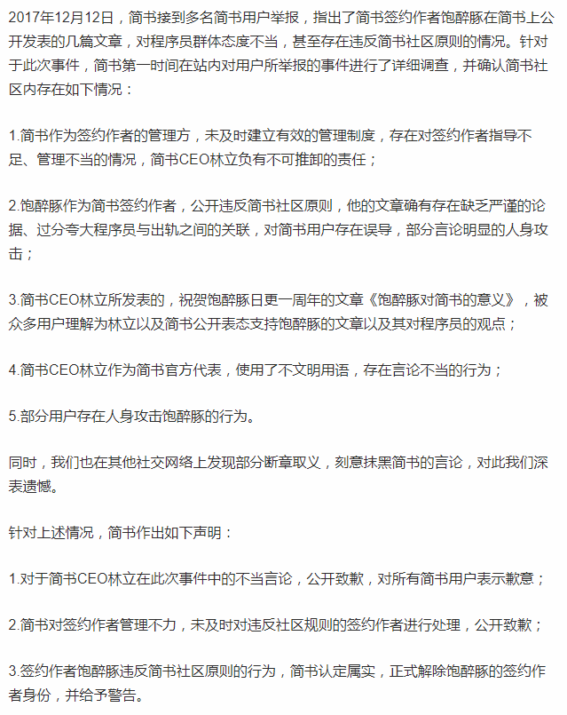
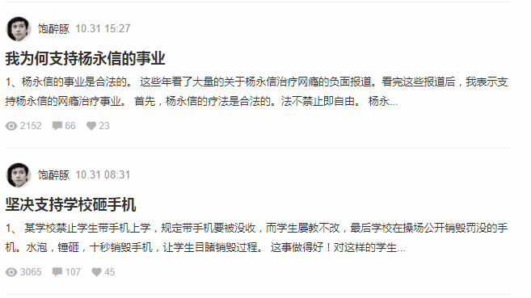
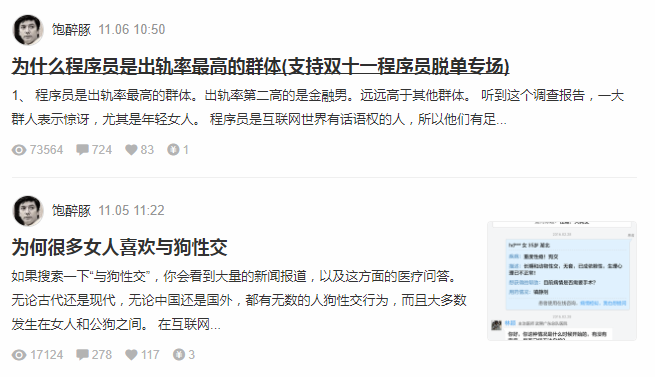
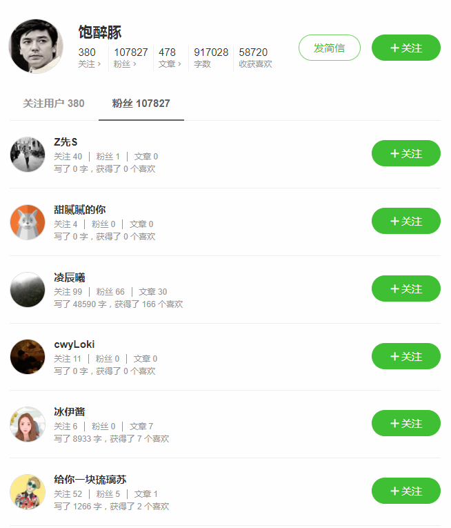
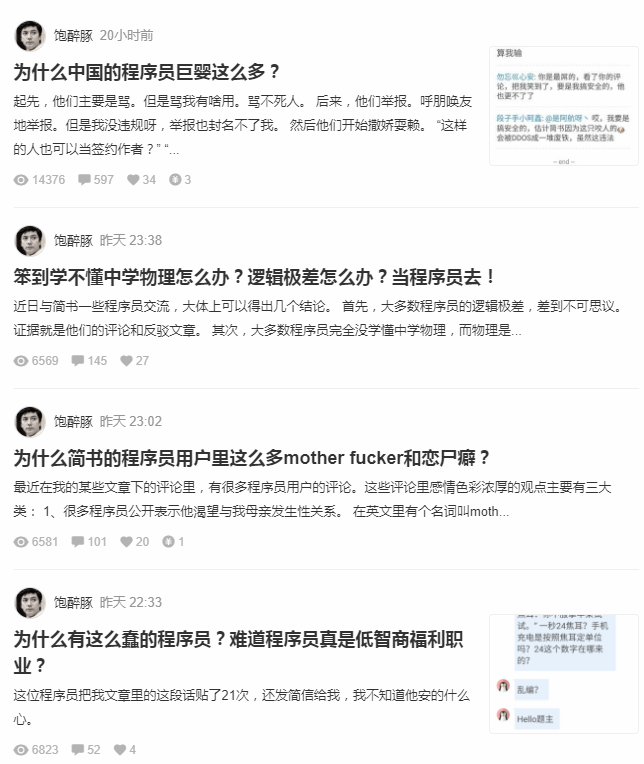
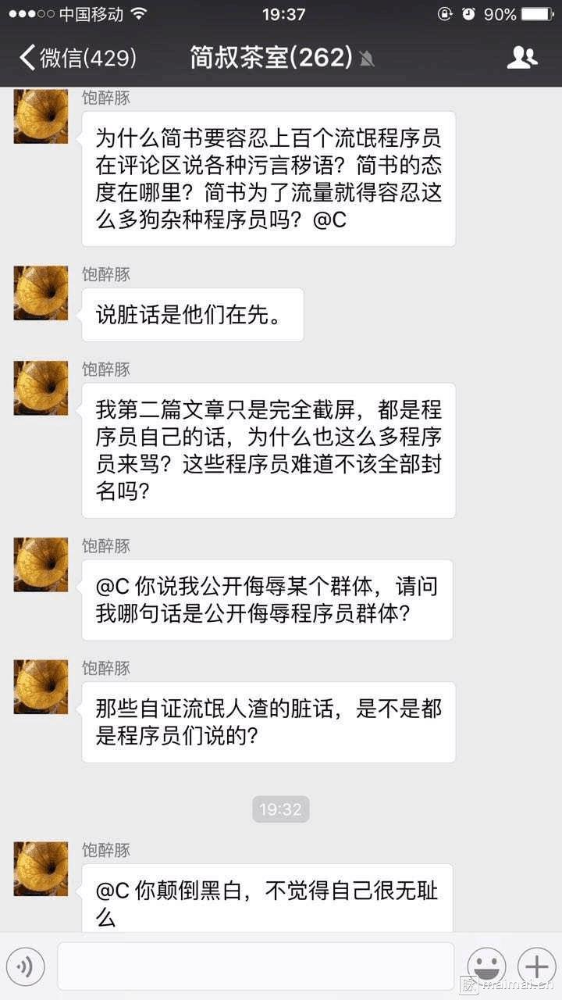
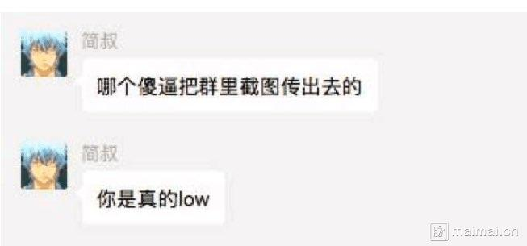

# 简书事件记录

欢迎各位提交更多 pull request 来揭露伪装成小清新的简书的各种恶心行为

## 目前进展

简书事件发生在 11月，但主要发酵时间在 2017.12.12 和 2017.12.13 两天，这一个半月间官方本着只要能炒话题就行，侮辱其它人符合简书的价值观，又没什么大不了的态度一直不理会任何人的投诉，直到 13 号晚上在压力下才不得己发表了以下不痛不痒的文章表示道歉，可以说毫无诚意和底线。

简书道歉文

## 事件过程

简书签约作者饱醉豚（和简书CEO是好友）在简书上发表多篇三观不正的文章，公然支持电疗，侮辱女性

令人发指的是这货在简书上还有不少粉丝，而此时简书CEO简叔则默许其行为

随后该货又开始在简书上发表文章恶心诋毁程序员群体

该文章引起了广大程序员的不满，很多人都在其帖子下回帖，然而饱醉豚在随后又更加变本加厉的展现其恶心的三观

而对于其行为，简书CEO不但不与阻止，还表示点赞（从知乎上了解到原来这两人原来是朋友，那就难怪了）

随后，脉脉上爆出了简书内部群聊的截图，可以看到其对于自己的行为一直理直气壮，没有丝毫反省

而此时简书CEO对于他这位朋友则是继续支持，并发表以下信息

之后事件进一步升温，脉脉匿名区上越来越多的人表示要卸载简书

## 结果

整件事最可怜的是简书的程序员们，帮老板干活还要被老板侮辱。说真的，你们还要为这种垃圾工作吗，你们是有技术的，并不会找不到工作，年后拿了年终奖该跳的早点跳，要有尊严的活着。

简书当初主要凭着 Markdown 编辑器和抄袭 Medium 吸引了一大群程序员群体，然后打开了口碑开始越做越大，如今有一定名气后又开始支持诋毁程序员，侮辱女性，是谁给了这种平台这样的权力，是哪些公司瞎了眼投资了他们。就是以下这些公司，希望这些公司能够帮助简书改邪归正而不是同流合污

- 君联资本
- 海纳亚洲创投基金（SIG）
- 赛富基金
- 戈壁投资

